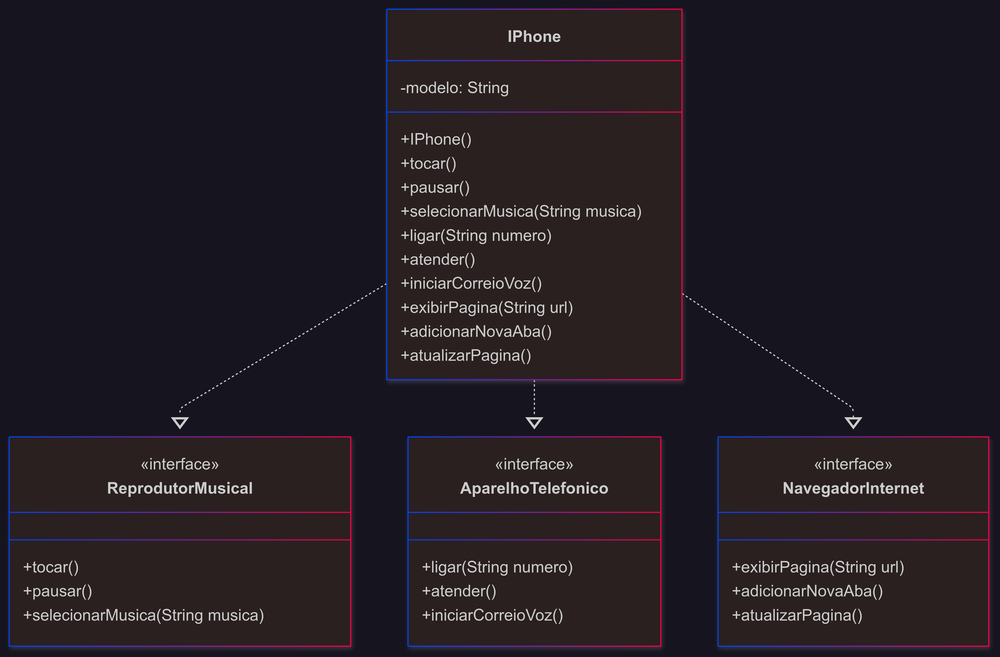

# 📱 Desafio: Modelagem e Diagramação do Componente iPhone

Este projeto foi desenvolvido como parte da trilha de Java da [DIO](https://www.dio.me), com o objetivo de aplicar conceitos de **Programação Orientada a Objetos (POO)** e **modelagem UML**, inspirados no lançamento do primeiro iPhone em 2007.

---

## 🚀 Objetivo

Modelar e implementar o componente **iPhone**, simulando suas funcionalidades como:

- 🎵 Reprodutor Musical  
- 📞 Aparelho Telefônico  
- 🌐 Navegador na Internet  

---

## 📸 Diagrama UML

O diagrama abaixo representa a estrutura de classes e interfaces utilizadas no projeto:



---

## 🧠 Funcionalidades

Cada funcionalidade foi abstraída em uma **interface**, e a classe `IPhone` implementa todas elas:

| Interface             | Métodos                                                                 |
|-----------------------|-------------------------------------------------------------------------|
| `ReprodutorMusical`   | `tocar()`, `pausar()`, `selecionarMusica(String musica)`               |
| `AparelhoTelefonico`  | `ligar(String numero)`, `atender()`, `iniciarCorreioVoz()`             |
| `NavegadorInternet`   | `exibirPagina(String url)`, `adicionarNovaAba()`, `atualizarPagina()`  |

---

## 📂 Estrutura do Projeto

```bash
DESAFIOS/
├── .vscode/
├── bin/
├── docs/
│   └── diagrama.png
├── lib/
├── poo/
│   └── README.md
└── src/
    ├── AparelhoTelefonico.java
    ├── IPhone.java
    ├── Main.java
    ├── NavegadorInternet.java
    └── ReprodutorMusical.java
```


##  🎯 Resultado Esperado
Ao executar o projeto, você verá no terminal a simulação das funcionalidades do iPhone:

Bem-vindo ao iPhone (1ª geração)

=== REPRODUTOR MUSICAL === <br>
Selecionando música: Tina Turner - Simply The Best<br>
Tocando música...<br>
Música pausada.<br>

=== APARELHO TELEFÔNICO ===<br>
Ligando para: 123-4567<br>
Chamada atendida.<br>
Iniciando correio de voz...<br>

=== NAVEGADOR NA INTERNET ===<br>
Exibindo página: http://www.apple.com<br>
Nova aba adicionada.<br>
Página atualizada.<br>

## 📚 Referência Histórica

Inspirado no momento icônico em que Steve Jobs apresentou o primeiro iPhone ao mundo. <br>
📺 [Asista aqui a Apresentação de lançamento do iPhone](https://www.youtube.com/watch?v=9ou608QQRq8) — Uma versão legendada.